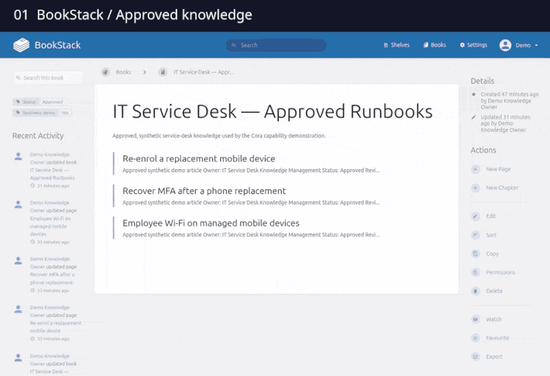

# General AI agent capability demo

A synthetic capability demo for product owners and developers. It
shows a Clem-managed Codex worker, Cora, grounding service-desk assistance in a
real BookStack knowledge source and publishing a private Freshservice note
through an isolated AgentBus workflow.



*Selected excerpts from a real run using synthetic ticket data. The first three
segments are accelerated; the final private note is shown at normal speed.
Ticket metadata remains subject to human approval.*

The implemented path demonstrates:

1. A knowledge owner publishes governed synthetic runbooks in BookStack.
2. Cora reads one scoped Freshservice ticket through a credential-isolating
   gateway.
3. Cora searches BookStack through a separate read-only gateway and receives
   page owner, review date, stable URL, and revision-bound citations.
4. A validator checks every proposed quotation against the current BookStack
   page revision.
5. Cora emits its intake, research, and action request on the real isolated
   Civo AgentBus.
6. The policy gateway revalidates the hash-bound artifact and ticket version,
   then publishes one grounded **private** Freshservice note autonomously.
7. Only optional metadata tags remain approval-gated inside Freshservice.

BookStack is the governed authoring and source-of-truth system in this demo. It
is not presented as a vector database or a complete RAG platform. The
knowledge connector is replaceable, so Confluence can occupy the same boundary
in a customer deployment.

The current implementation does not let Cora publish knowledge changes.
Agent-proposed BookStack drafts with human publication are a deliberate next
increment. Public Freshservice replies and consequential ticket-field changes
also remain outside Cora's autonomous permission.

This is capability evidence, not a production-readiness, reliability, KPI,
vendor-selection, or EU AI Act conformity assessment.

## Local verification

```bash
python3 -m unittest discover -s tests
python3 -m democtl kb search "new phone wifi mfa"
python3 -m democtl ticket auth-check
```

The Markdown command remains as a local fallback for tests. On the demo host,
Cora instead uses:

```bash
gaidemo-kb-search "replacement phone wifi mfa"
gaidemo-kb-read bookstack://pages/PAGE_ID@revision-REVISION
gaidemo-proposal-validate artifacts/proposal.json
```

Freshservice and BookStack credentials are held by their respective gateways;
Cora receives neither. All demo data must remain synthetic. See
`docs/architecture.md`, `docs/demo-script.md`, and `recording/README.md`.

## Setup

For local tests, use Python 3.11+ and Node.js 22+:

```bash
python3 -m venv .venv
.venv/bin/pip install -e .
npm ci
.venv/bin/python -m unittest discover -s tests
npm test
```

The live workflow additionally needs a Linux host with systemd, Docker Compose,
the Clem CLI, AgentBus binaries, and a Freshservice demo tenant. The installers
under `infra/` expect these prerequisites; they are not a one-command cloud
provisioner. BookStack and MariaDB are installed by the included Compose setup.
Keep live data and credentials out of this repository.

Copy `.env.example` to the ignored `.env` and configure your synthetic tenant
with `FRESHWORKS_BASE_URL=https://YOUR-TENANT.freshservice.com`. The recording
scripts require this variable and only capture the specified tenant and ticket.
Before provisioning a fork, update `coordination.github_repo` and
`operator.github_logins` in `clem.yaml` to your trusted repository and operator.

For Clem's GitHub credential, copy `secrets.example.yaml` to the ignored
`secrets.sops.yaml`, replace the placeholder with your own scoped token, and
copy `.sops.example.yaml` to `.sops.yaml` with your own **public** age recipient.
Encrypt `secrets.sops.yaml` with SOPS before deploying it. Keep the private age
identity outside the repository. The examples contain no usable credentials.

Browser recording also requires an authenticated synthetic Freshservice session
and SSH tunnels described in [the recording runbook](recording/README.md):

```bash
npm run recording:install
set -a
. ./.env
set +a
node recording/launch-browser.mjs TICKET_ID
```

FFmpeg with `drawtext` and Gifsicle are needed only to regenerate the README GIF.

## License

This demo's code and documentation are licensed under the [MIT License](LICENSE).
Clem, AgentBus, Playwright, BookStack, MariaDB, and the other external tools retain
their own licenses. Freshservice is a separately licensed service.
