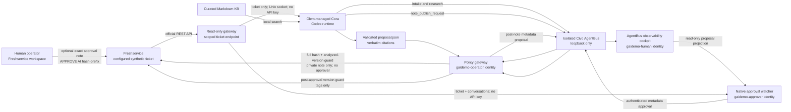

# Demo architecture and trust boundaries

The Freshservice key is stored in `/etc/gaidemo/freshworks.env`, readable by the
`gaidemo-operator` gateway identity but not by Cora, the cockpit, or the native
approval watcher. Cora and the watcher can only use the ticket-scoped read
gateway. The cockpit, watcher, and policy gateway have distinct OS identities,
state directories, and AgentBus mailbox tokens. The cockpit endpoint returns
HTTP 410 for approval attempts: it is an observability surface, not a frontline
operator interface and not AgentBus itself.

The worker and gateway share only the validated proposal artifact through the
`gaidemo-proposals` group. The gateway accepts Cora's `note_publish_request`
only when the full artifact SHA-256, ticket ID, and analyzed ticket version all
match. It may then perform exactly one Freshservice action: add the grounded
private note. The note embeds the proposal hash as an idempotency and audit
reference. A persisted marker prevents Freshservice's eventually consistent
parent-ticket version from causing duplicate notes.

After the parent version settles, the gateway emits a metadata-only proposal.
The watcher accepts exactly one new private outgoing note whose text matches the
current proposal hash prefix and whose Freshservice `user_id` matches the
configured operator. It rejects concurrent ticket-field changes and additional
conversations. The gateway rechecks the full proposal SHA-256 and the ticket
version produced by that approval note, then applies tags only. A permanently
stale action emits an auditable rejection and is acknowledged instead of
poisoning the AgentBus delivery queue.

This is a live capability demonstration over a synthetic scenario, not a
production-readiness, reliability, KPI, legal-compliance, or vendor-selection
result. Clem was selected because the consultant already knows it well;
alternatives should be evaluated separately against the demonstrated control
capabilities.
