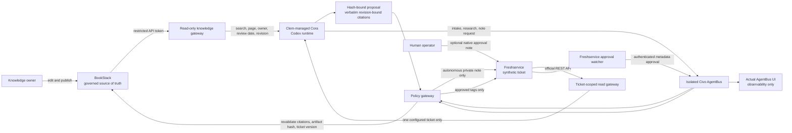

# Demo architecture and trust boundaries

## Knowledge boundary

BookStack and MariaDB run as two containers bound to host loopback. The UI is
opened for recording through an SSH tunnel. Pages contain explicit status,
owner, classification, review date, and synthetic-data markers.

Cora has no BookStack API credential. A dedicated system service owns a
restricted BookStack reader token and exposes only three Unix-socket actions:
search, read one returned citation, and validate a proposal. Citations have the
form `bookstack://pages/3@revision-1`. Validation fails closed if the live page
revision differs, or if a quoted sentence is not present verbatim.

The policy gateway independently repeats citation validation immediately before
publishing a Freshservice note. This makes the knowledge result derived and
rebuildable while BookStack remains the governed source.

## Freshservice action boundary

Cora has no Freshservice credential. It reads only the configured synthetic
ticket through a Unix-socket gateway. The Freshservice key is readable by the
policy gateway but not by Cora, the BookStack gateway, or AgentBus UI.

The gateway accepts a note request only when the complete proposal SHA-256,
ticket ID, analyzed ticket version, BookStack citations, and stored artifact
all agree. It can then add one idempotent private operator note. It cannot send
a public reply through this path.

Optional tags are handled separately. A human adds the exact approval note in
Freshservice; the watcher authenticates that native Freshservice identity, and
the policy gateway applies tags only after another version guard. Category
changes, requester-visible replies, access resets, and knowledge publication
are not implemented autonomous actions.

The previous cockpit is a custom observability prototype. It is not AgentBus,
Clem, or ZestMem product UI and is intentionally excluded from the main demo
cut. Only Cora's real terminal, the actual AgentBus UI, BookStack, and native
Freshservice appear in the principal evidence.
