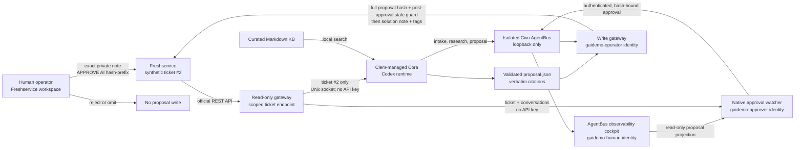

# Demo architecture and trust boundaries

The Freshservice key is stored in `/etc/gaidemo/freshworks.env`, readable by
the `gaidemo-operator` identity but not Cora, the cockpit, or the native
approval watcher. Cora and the watcher can only use the ticket-scoped read
gateway. The cockpit, watcher, and write gateway have distinct OS identities,
state directories, and AgentBus mailbox tokens. The cockpit endpoint returns
HTTP 410 for approval attempts; it is an observability surface, not the
frontline operator interface and not AgentBus itself.

The worker and write gateway share only the validated proposal artifact through
the `gaidemo-proposals` group. Parent directories are traverse-only for that
group, the artifacts directory is setgid, and `proposal.json` is mode `0640`;
the gateway cannot read the worker's other private state.

The watcher accepts exactly one new private, outgoing note whose text matches
the current proposal hash prefix and whose Freshservice `user_id` matches the
configured operator. It rejects concurrent ticket-field changes or additional
conversations. The write gateway then rechecks the full proposal SHA-256 and
the ticket version produced by the approval note before mutating Freshservice.

This is a live capability demonstration over a synthetic scenario, not a
production-readiness, reliability, KPI, or vendor-selection result. Clem was
selected because the consultant already knows it well; alternatives should be
evaluated separately against the demonstrated control-capability bar.
