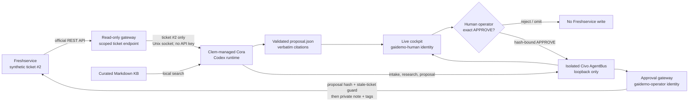

# Demo architecture and trust boundaries

The Freshservice key is stored in `/etc/gaidemo/freshworks.env`, readable by
the approval-gateway identity but not Cora or the cockpit identity. Cora can
only use the ticket-scoped read gateway. The cockpit and approval gateway also
hold separate AgentBus mailbox tokens and cannot read each other's token.

This is a live capability demonstration over a synthetic scenario, not a production-readiness,
reliability, KPI, or vendor-selection result. Clem was selected because the
consultant already knows it well; alternatives should be evaluated separately
against the demonstrated control and capability bar.
