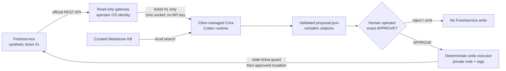

# Demo architecture and trust boundaries

The Freshservice key is stored in `/etc/gaidemo/freshworks.env`, readable by
the operator identity but not the Clem agent. The gateway has no mutation
route and rejects every ticket ID except the configured synthetic ticket.

This is a scripted capability demonstration, not a production-readiness,
reliability, KPI, or vendor-selection result. Clem was selected because the
consultant already knows it well; alternatives should be evaluated separately
against the demonstrated control and capability bar.
